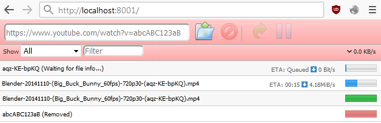

#  Web GUI Server for YouTube Downloader Tool

Node.js based solution inspired by Transmission web-interface. Suitable for Windows and Linux

---

### *NOTE: The code moved to [self-hosted](https://git.serenity-island.net/sie-foss/youtube-dl-web-gui ) and [public](https://codeberg.org/sie-foss/youtube-dl-web-gui) git repositories due to [number of issues](https://github.com/RuStrannik/problems-with-github-and-microsoft) with GitHub and Microsoft (mirrors: [`(m1)`](https://codeberg.org/strannik/problems-with-github-and-microsoft)  [`(m2)`](https://git.serenity-island.net/nik/problems-with-github-and-microsoft)).*

---



NOTE1: This repository is for those, who for certain reasons prefer nodejs running as server. If this is not the case, I would recommend [native python-based web gui server](https://github.com/d0u9/youtube-dl-webui) since `youtube-dl`/`yt-dlp` are essentially a python scripts, so it's better not to create a zoo of runtime environments.

---
NOTE2: 
- This UI supports running through reverse proxy like `nginx` under subdirectory. (ex. https://example.com/ytdl-web-gui )
	- required changing variable: `web-root = '/ytdl-web-gui'`
	- recommended `nginx` config:
	```nginx
    server {
        #server_name default server;
        listen 80 default_server;
 
        location /ytdl-web-gui {
            location = /ytdl-web-gui { return 301 /ytdl-web-gui/; } # adds trailing slash only for 1st lvl for correct relative path handling
            proxy_set_header Host $host;
            proxy_set_header X-Real-IP $remote_addr;
            proxy_set_header X-Forwarded-For $proxy_add_x_forwarded_for;
            proxy_pass http://localhost:8001;
        }
    }
	```
